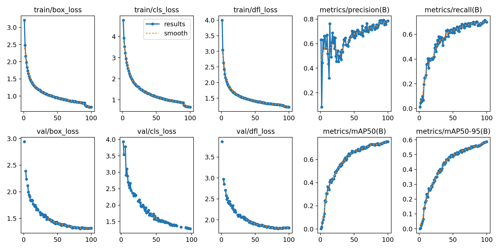
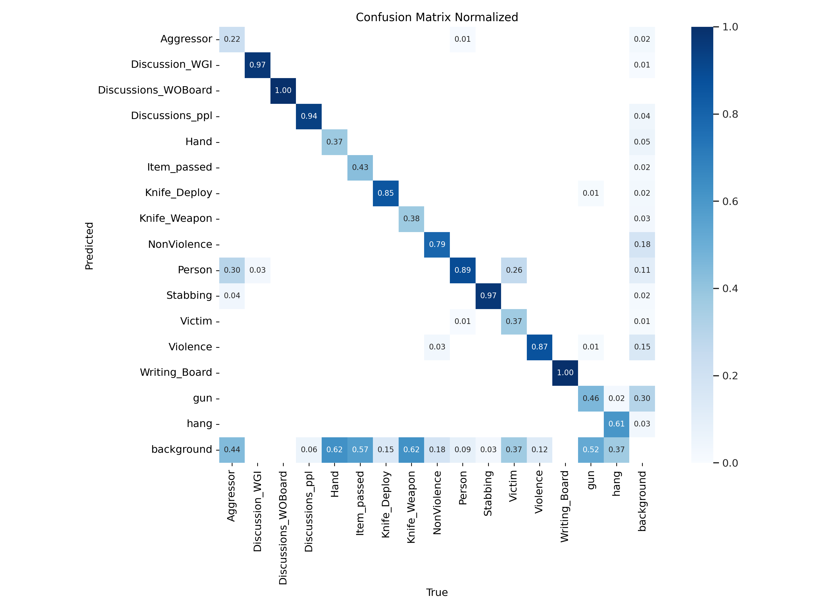
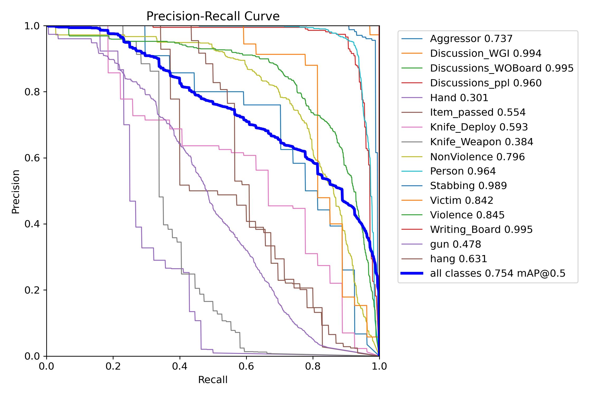

# 🧠 Abnormal Activity Detection Using YOLOv12

This project demonstrates how to fine-tune the **YOLOv12 object detection model** to detect various types of abnormal activities in classroom or surveillance environments using a custom dataset from [Roboflow Universe](https://universe.roboflow.com).

> 🧠 This training was conducted using **Kaggle Notebooks** and is publicly available here: [Abnormal Activity Detection Using YOLOv12 on Kaggle](https://www.kaggle.com/code/muthanii/abnormal-activity-detection-using-yolov12)

---

## 🚀 Quick Overview

This model was trained to recognize abnormal activities like fighting, weapons, and suspicious interactions in a classroom-like environment. It uses the latest YOLOv12 architecture and was trained for 100 epochs.

Below are a few visual results that show how well the model performed:

### 📈 Training Results


### 🔍 Normalized Confusion Matrix


### 📊 Precision-Recall Curve


These graphs show that the model achieves strong performance across multiple classes.

---

## ⚙️ Setup & Training (Optional)

To reproduce or fine-tune the model, here are the minimal setup steps:

### Requirements
```bash
pip install -q git+https://github.com/sunsmarterjie/yolov12.git \
tensorflow==2.17.0 roboflow supervision flash-attn
```

### Set Roboflow API Key

> 💡 **Note**: Use the appropriate method depending on your notebook platform.

#### ✅ For Kaggle Notebooks:
```python
from kaggle_secrets import UserSecretsClient
import os

user_secrets = UserSecretsClient()
os.environ["ROBOFLOW_API_KEY"] = user_secrets.get_secret("ROBOFLOW_API_KEY")
```

#### ✅ For Google Colab:
```python
import os
from google.colab import userdata

os.environ["ROBOFLOW_API_KEY"] = userdata.get("ROBOFLOW_API_KEY")
```

### Training Code
```python
from ultralytics import YOLO
model = YOLO('yolov12s.yaml')
model.train(data='path/to/data.yaml', epochs=100)
```

---

## 📚 References
- [YOLOv12 GitHub Repository](https://github.com/sunsmarterjie/yolov12)
- [Roboflow Dataset](https://universe.roboflow.com/)
- [Ultralytics YOLO Docs](https://docs.ultralytics.com)

---

## 🧑‍💻 Author & Credits
- Built with 🤖 YOLOv12 and 💾 Roboflow
- Trained on Kaggle: [Notebook Link](https://www.kaggle.com/code/muthanii/abnormal-activity-detection-using-yolov12)

